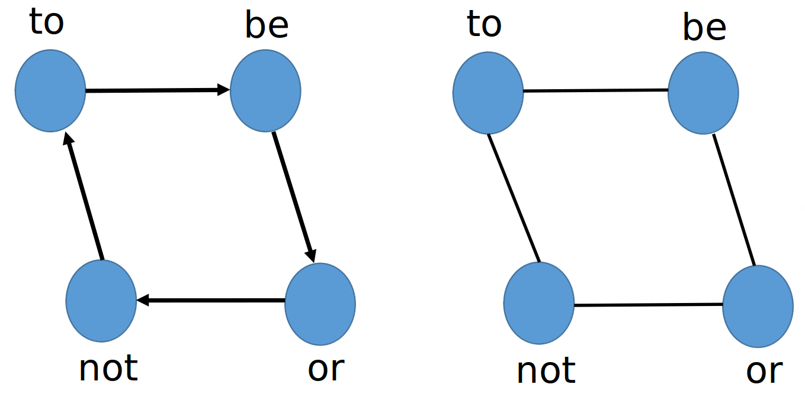
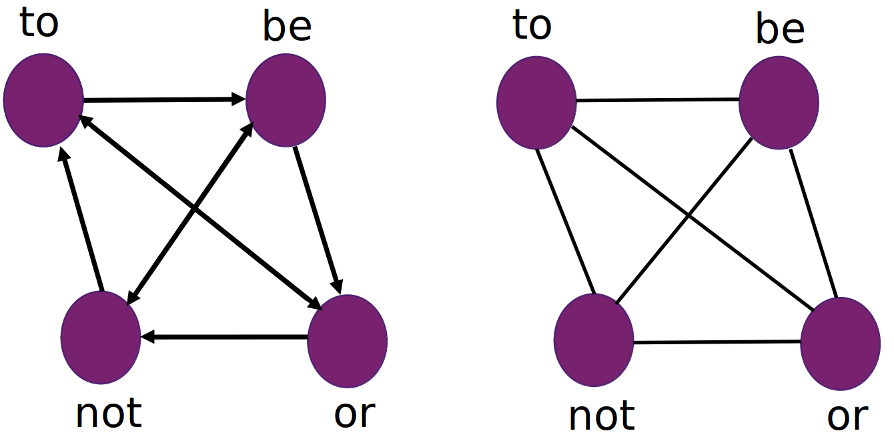

# Co-occurrence Networks
co-occurrence-networks v1.0

Code that creates a co-occurrence network (the nodes represent the words and the edges connect adjacent words) from a pre-processed text file (according to one's needs). The network is stored in a PAJEK file format.

## Usage

It creates a co-occurrence network from a pre-processed (according to one's needs) text file, input.txt. The network is stored in a PAJEK format file, output.paj.

```
python get_cooccurrence.py -u 1 input.txt output.paj
```

## Options

```
Usage: python get_cooccurrence.py -d|-u <windowSize> <inputfile> <outputfile>
Options:
  -d             It creates a directed co-occurrence network.
  -u             It creates an undirected co-occurrence network.

Input:
  <windowSize>   The size of the co-occurrence window. If it is equal to 1, each word will be connected to its immediate neighbor. If the size is 2, each word is connected to its first and second closest neighbors. The accepted values are 1, 2, and 3.
  <inputfile>    Input text file.
  <outputfile>   Output network file in a PAJEK format. 

```

## Example

Given the following text sample:

```
To be or not to be

```

The co-occurrence networks (directed and undirected) obtained from the text sample for a window size of 1 are:



The PAJEK files will be:

In addition, the co-occurrence networks (directed and undirected) obtained from the text sample for a window size of 2 are:



The PAJEK files will be: